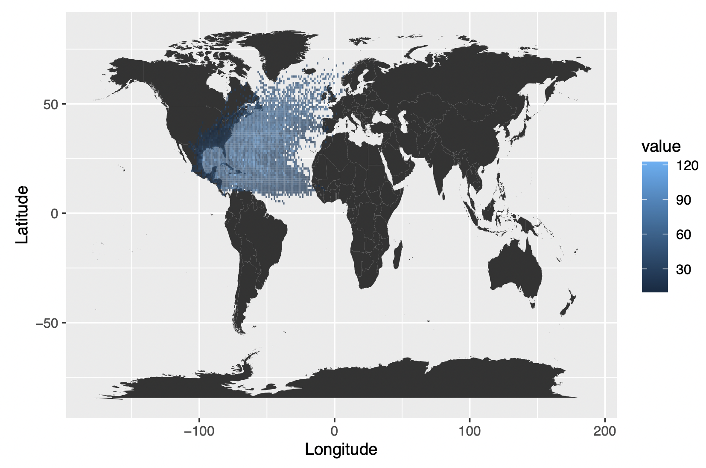
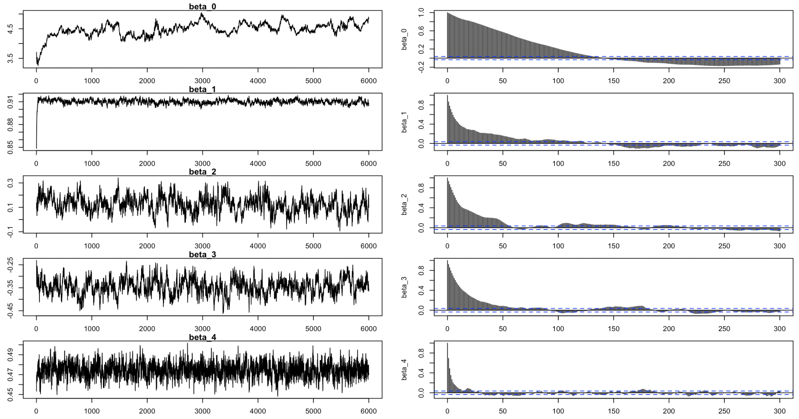
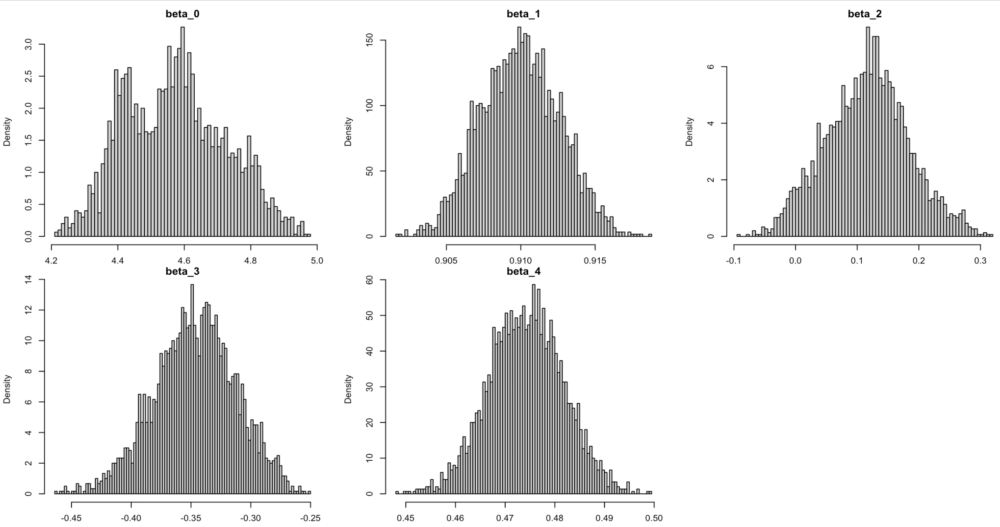
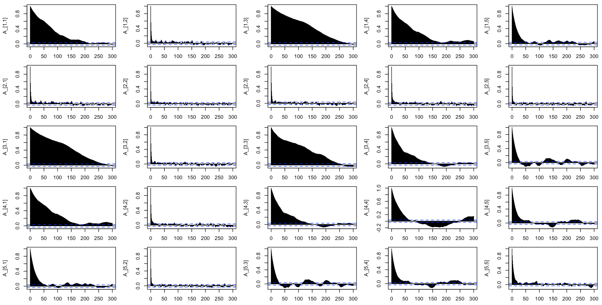

```{r setup, include=FALSE}
knitr::opts_chunk$set(echo = TRUE)
options(tinytex.verbose = TRUE)
library(knitr)
library(tibble)
```

\newpage 

# Background and Objectives

As hurricanes affect people, the ability to forecast hurricanes is essential for minimizing the risks in suffered areas. Hereby, a hierarchical Bayesian strategy for modeling North Atlantic hurricane counts since 1950 is illustrated. Model integration would be expected to achieve through a Markov chain Monte Carlo algorithm. Contingent on the availability of values for the covariates, the models can be used to explore the seasonality among track data and make predictive inferences on hurricanes.

The data given has 703 observations and following features are recorded for each hurricanes in the North Atlantic: 

* ID: ID of the hurricanes

* Season: In which the hurricane occurred

* Month: In which the hurricane occurred

* Nature: Nature of the hurricane (ET-Extra tropical;DS-Disturbance;NR-Not rated;SS-Sub tropical; TS-Tropical storm)

* time: dates and time of the record

* Latitude and Longitude: The location of a hurricane check point

* Wind.kt: Maximum wind speed (in Knot) at each check point

# Exploratory Data Analysis

The dataset collected the track data of 703 hurricanes in the North Atlantic area since 1950. In the dataset, we have nearly 22,038 observations of 702 hurricanes ranging from the year 1950 to 2013. For all the storms, their location (longitude & latitude) and maximum wind speed were recorded every 6 hours. The latitude ranges from 5 to 70.7, while longitude ranges from -107.7 to 13.5. The lowest observed wind speed is 10 Knot, and the maximum wind speed is 165 knots.

{width=70%}

Figure 1 is the Hurricane data on World Map. The graph shows the Distributions of hurricane, and the blue dot stands for the wind speed. The darker the blue dot is, the lower the wind speed is.

{width=70%}

Figure 2 is the hurricane frequency and average wind speed by Month. September is the month with the most hurricanes, while there are no hurricanes in February and March. Hurricanes in September also have the highest average wind speed as we can see in the average speed plot.

{width=70%}

Figure 3 is the hurricane frequency and average wind speed by Year, we can see in general, we have more observations in recent years compared to 50 years ago. However, the average wind speed seems to have a decreasing trend.

{width=70%}

Figure 4 is Hurricane Wind Speed Boxplot by Nature, more than half of nature is in Tropical Storm category. This nature also has the highest average wind speed at about 60 knots, while the disturbance and not rated hurricanes have average wind speed at around 20 knots.

# Methods

## Baysian Model

We introduced a hierarchical Bayesian model for our Hurricane dataset.

### Model

For each individual hurricane,

$$Y_{i}(t+6) =\beta_{0,i}+\beta_{1,i}Y_{i}(t) + \beta_{2,i}\Delta_{i,1}(t)+
\beta_{3,i}\Delta_{i,2}(t) +\beta_{4,i}\Delta_{i,3}(t)  + \mathbf{X}_i\gamma+ \epsilon_{i}(t), \\$$

where $Y_{i}(t)$ is the wind speed at time t (i.e. 6 hours earlier), and $\Delta_{i,1}, \Delta_{i,2}, \Delta_{i,3}$ are the changes of latitude, longitude and wind speed between t and t - 6. $\mathbf{X}_i = (x_{i,1}, x_{i,2}, x_{i,3})$ are covariates with fixed effect gamma, where $x_{i,1}$ be the month of year when the i-th hurricane started, $x_{i,2}$ be the calendar year of the i-th hurricane, and $x_{i,3}$ be the type of the i-th hurricane. Finally, $\epsilon_{i}(t)$ is the random error for i-the hurricane, independent across time t.

### Setting of Priors 

1.
$$\begin{bmatrix}\beta_{0,i} \\\beta_{1,i}\\ \beta_{2,i} \\\beta_{3,i} \\\beta_{4,i}\end{bmatrix} \sim MVN(\begin{bmatrix}\mu_{0} \\\mu_{1}\\ \mu_{2} \\\mu_{3} \\\mu_{4}\end{bmatrix},\Sigma)$$

2.
$$\epsilon_i \sim N(0, \sigma^2)$$

3.
$$\begin{bmatrix}\mu_{0} \\\mu_{1}\\ \mu_{2} \\\mu_{3} \\\mu_{4}\end{bmatrix} \sim MVN(\begin{bmatrix}0 \\0\\ 0 \\0 \\0\end{bmatrix},
V)$$

$$ f_{\mu}(\mu) \propto det(V)^{\frac{-1}{2}}e^{\frac{-1}{2}\mu^\intercal V^{-1}\mu} \propto e^{\frac{-1}{2}\mu^\intercal V^{-1}\mu}$$

4.
$$\Sigma \sim W^{-1}(S, \nu = 5)$$

Due to property of Wishart distribution, $$\Sigma^{-1} \sim W(S^{-1}, \nu = 5)$$
$$f_{\Sigma^{-1}}(\Sigma^{-1})   = |\Sigma^{-1}|^{\frac{\nu-d-1}{2}}exp({-\frac{tr(S\Sigma^{-1})}{2}}) \propto |\Sigma^{-1}|^{\frac{\nu-5-1}{2}}exp({-\frac{tr(S\Sigma^{-1})}{2}}) $$ 

5.
$$\gamma \sim MVN(\begin{bmatrix} 0 \\ 0\\ ... \\0 \end{bmatrix}, 0.005^2I_{14})$$

Since Month and Nature are categorical variables, the dimension of the $\gamma$ is $14\times1$.

$$f_\gamma(\gamma) = (14 \times 0.005^2)^{-1/2} exp(-\frac{\gamma ^\intercal 0.005^2I_{14}\gamma}{2}) \propto exp(-\frac{400\gamma ^\intercal\gamma}{2}) $$

6.
$$\sigma \sim Half-Cauchy(0,10)$$
$$f_\sigma(\sigma)  = \frac{2 \times 10}{\pi(\sigma^2+10^2)}$$
By transformation theorem 

$$f_{\sigma^2}(\sigma^2)  = \frac{2 \times 10}{\pi(\sigma^2+10^2)} \frac{1}{2\sigma}\propto \frac{1}{\pi(\sigma^2+10^2)\sigma}$$

### Likelihood

Because random effects coefficients $\beta_i$ is normal, $Y_i|\beta_i$ also follows a normal distribution by property of normal distribution. 

For each hurricane $Y_i$

$$\begin{aligned}Y_i|\beta_i, \mu, \sigma^2, \Sigma, \gamma \sim & MVN(\beta_{0,i}+\beta_{1,i}Y_{i}(t) + \beta_{2,i}\Delta_{i,1}(t)+ \beta_{3,i}\Delta_{i,2}(t) +\beta_{4,i}\Delta_{i,3}(t)  + \mathbf{X}_i\gamma,  \sigma^2I_{n_i}) \\
= & MVN(D_{i}\beta_{i}+X_i\gamma,  \sigma^2I_{n_i})\end{aligned}$$

where 

$$Y_{i} = \begin{bmatrix}Y_i(t_2) \\Y_i(t_3) \\ \vdots \\ Y_i(t=t_j) \\ \vdots \\ Y_i(t = t_{n_i}) \end{bmatrix}_{n_i\times 1}$$

$$\begin{aligned}D_{i}(t) =& \begin{bmatrix} 1 & Y_i(t) & \Delta_{i,1}(t)&\Delta_{i,2}(t)& \Delta_{i,3}(t)\end{bmatrix} \\
=&\begin{bmatrix} 1 & Y_i(t=t_1 ) & \Delta_{i,1}(t_1, t_0)&\Delta_{i,2}(t_1, t_0)& \Delta_{i,3}(t_1, t_0)\\
1 & Y_i(t=t_2) & \Delta_{i,1}(t_2, t_1)&\Delta_{i,2}(t_2, t_1)& \Delta_{i,3}(t_2, t_1)\\ \dots\\ 1 & Y_i(t=t_{j-1}) & \Delta_{i,1}(t_{j-1}, t_{j-2})&\Delta_{i,2}(t_{j-1}, t_{j-2})& \Delta_{i,3}(t_{j-1}, t_{j-2})\\\dots\\ 1 & Y_i(t = t_{n_{i-1}} ) & \Delta_{n,1}(t_{n_{i-1}} - t_{n_{i-2}})&\Delta_{n,2}(t_{n_{i-1}} - t_{n_{i-2}})& \Delta_{n,3}(t_{n_{i-1}} - t_{n_{i-2}})\end{bmatrix}_{n_i\times 5}\end{aligned}$$
$$\beta_i = \begin{bmatrix} \beta_{0,i} \\\beta_{1,i}\\\beta_{2,i} \\\beta_{3,i}\\\beta_{4,i}\end{bmatrix}_{5\times 1}$$ $$X_i = \begin{bmatrix} X_{i,month} & x_{i,season} & X_{i,type}\end{bmatrix}_{n_i\times 14}$$ 
$$\gamma = \begin{bmatrix} \gamma_1 \\ \gamma_2 \\... \\ \gamma_{14}\end{bmatrix}_{14\times 1}$$

Likelihood for the ith hurricane is 

$$f(Y_i|\beta_i,\mu, \sigma^2, \Sigma, \gamma) = det(\sigma^2I_{n_i})^{-1/2}exp(-\frac{1}{2}{(Y_i - D_{i}\beta_{i}-X_i\gamma)^\intercal(\sigma^2I_{n_i})^{-1}(Y_i - D_{i}\beta_{i}-X_i\gamma) })$$

To calculate the joint likelihood for $Y = \begin{bmatrix}Y_1 & Y_2 \dots Y_i \dots Y_H\end{bmatrix}^\intercal$, we denote total number of observations for all hurricanes as $N = \sum_{i=0}^{H} n_i$ where $n_i$ is the total number of observation for the ith hurricane and $H$ is the total number of hurricanes.

All random effects coefficients $\beta_i$ in $$\begin{aligned}B =& \begin{bmatrix} \beta_1 & \beta_{2} \dots & \beta_{i} & \dots \beta_{H} \end{bmatrix}\\ =&\begin{bmatrix} \beta_{0,1} &\beta_{0,2}&\dots&\beta_{0,i}&\dots & \beta_{0,H} \\ \beta_{1,1} & \beta_{1,2}&\dots& \beta_{1,i} &\dots & \beta_{1,H}\\ \beta_{2,1} & \beta_{2,2}&\dots& \beta_{2,i} &\dots & \beta_{2,H} \\\beta_{3,1} & \beta_{3,2}&\dots& \beta_{3,i} &\dots & \beta_{3,H} \\\beta_{4,1} & \beta_{4,2}&\dots& \beta_{4,i} &\dots & \beta_{4,H}\end{bmatrix}_{5\times H}\end{aligned}$$

Design matrix for random effects for all hurricanes are in $D$. $D =\begin{bmatrix} D_{1}(t) \\ D_{2}(t) \\ \vdots \\  D_{i}(t)\\  \vdots \\ D_{H}(t) \end{bmatrix}_{N\times 5}$


Due to independence of each hurricane, the joint likelihood is 
$$\begin{aligned}L_Y(B,\mu, \sigma^2, \Sigma,\gamma) =& \prod_{i=1}^{H} L_{Y_i}(\beta_i, \mu, \sigma^2, \Sigma,\gamma) \\
=& \prod_{i=1}^{H} det(\sigma^2I_{n_i})^{-1/2}exp(-\frac{1}{2}{(Y_i - D_{i}\beta_{i}-X_i\gamma)^\intercal(\sigma^2I_{n_i})^{-1}(Y_i - D_{i}\beta_{i}-X_i\gamma)}) \\
=& \frac{1}{\sigma^N}\prod_{i=1}^{H} exp(-\frac{1}{2}{(Y_i - D_{i}\beta_{i}-X_i\gamma)^\intercal(\sigma^2I_{n_i})^{-1}(Y_i - D_{i}\beta_{i}-X_i\gamma) })\end{aligned}$$

### Posterior

By Baye's Rule $$f(B,\mu, \sigma^2, \Sigma, \gamma |Y) \propto f(Y|B,\mu, \sigma^2, \Sigma,\gamma) \times f(B|\mu, \Sigma)  \times f(\mu)  \times f(\Sigma)  \times f(\sigma^2) \times f(\gamma)$$ 
where 
$$\begin{aligned}f(B|\mu, \Sigma)  =& \prod_{i=1}^{H} f(\beta_i|\mu, \Sigma) \\
=& \prod_{i=1}^{H} det(\Sigma)^{-1/2} exp(-\frac{(\beta_i-\mu)^\intercal \Sigma^{-1}(\beta_i-\mu)}{2}) \\
=& det(A)^{H/2}\prod_{i=1}^{H} exp(-\frac{(\beta_i-\mu)^\intercal A (\beta_i-\mu)}{2})\end{aligned}$$ where 
$A = \Sigma^{-1}$

$$ \begin{aligned} f(\mu) =& det(V)^{\frac{-1}{2}}exp({-\frac{\mu^\intercal V^{-1}\mu}{2}}) \end{aligned}$$

We'll only use $f_{\Sigma^{-1}}$ because only $\Sigma^{-1}$ shows up in the likelihood equation. We denote $A = \Sigma^{-1}$ in the posterior. 

$$f_{\Sigma^{-1}}(\Sigma^{-1})  \propto |\Sigma^{-1}|^{\frac{\nu-5-1}{2}}exp({-\frac{tr(S\Sigma^{-1})}{2}}) $$ 
$$f_{\sigma^2}(\sigma^2)  = \frac{2\times10}{\pi(\sigma^2+10^2)} \frac{1}{2\sigma}\propto \frac{1}{\pi(\sigma^2+10^2)\sigma}$$

$$\begin{aligned}f_{\gamma}(\gamma) =&exp(-\frac{400\gamma ^\intercal\gamma}{2})\end{aligned}$$

Final posterior

$$\begin{aligned} f(B,\mu, \sigma^2, \Sigma, \gamma |Y) \propto & f(Y|B,\mu, \sigma^2, \Sigma,\gamma) \times f(B|\mu, \Sigma)  \times f(\mu)  \times f(\Sigma^{-1})  \times f(\sigma^2) \times f(\gamma) \\
=& f(Y|B,\mu, \sigma^2, \Sigma,\gamma) \times f(B|\mu, A)  \times f(\mu)  \times f(A)  \times f(\sigma^2) \times f(\gamma) \\
=& \prod_{i=1}^{H} det(\sigma^2I_{n_i})^{-1/2}exp(-\frac{1}{2}{(Y_i - D_{i}\beta_{i}-X_i\gamma)^\intercal(\sigma^2I_{n_i})^{-1}(Y_i - D_{i}\beta_{i}-X_i\gamma)}) \times \\
& det(A)^{H/2}\prod_{i=1}^{H} exp(-\frac{(\beta_i-\mu)^\intercal A (\beta_i-\mu)}{2})\times \\
& det(V)^{\frac{-1}{2}}exp({-\frac{\mu^\intercal V^{-1}\mu}{2}}) \times \\ 
& |A|^{\frac{\nu-5-1}{2}}exp({-\frac{tr(SA)}{2}}) \times \\
&\frac{1}{\pi(\sigma^2+10^2)\sigma} \times \\
& exp(-\frac{400\gamma ^\intercal\gamma}{2}) 
\end{aligned}$$ 

### Conditional Posterior

For B,

$$\begin{aligned} f(B|\mu, \sigma^2, \Sigma, \gamma, Y)\propto  
& \prod_{i=1}^{H} det(\sigma^2I_{n_i})^{-1/2}exp(-\frac{1}{2}{(Y_i - D_{i}\beta_{i}-X_i\gamma)^\intercal(\sigma^2I_{n_i})^{-1}(Y_i - D_{i}\beta_{i}-X_i\gamma)}) \times \\
& det(A)^{H/2}\prod_{i=1}^{H} exp(-\frac{(\beta_i-\mu)^\intercal A (\beta_i-\mu)}{2}) \\
\propto & \prod_{i=1}^{H} exp(-\frac{1}{2}{(Y_i - D_{i}\beta_{i}-X_i\gamma)^\intercal(\sigma^2I_{n_i})^{-1}(Y_i - D_{i}\beta_{i}-X_i\gamma)}) exp(-\frac{(\beta_i-\mu)^\intercal A (\beta_i-\mu)}{2}) \\
=& exp(\frac{-1}{2}\sum_{i=1}^{H} \beta_{i}^\intercal ({D_i}^\intercal \sigma^{-2}I_{n_i} D_i + A)\beta_i - 2\beta_i^\intercal(D_i^\intercal \sigma^{-2}I_{n_i} Y_i - D_i^\intercal \sigma^{-2}I_{n_i} X_i \gamma + A \mu) \\
+& Y_i^\intercal \sigma^{-2}I_{n_i} Y_i  - 2Y_i^\intercal \sigma^{-2}I_{n_i} X_i \gamma  + \gamma^\intercal X_i^\intercal \sigma^{-2}I_{n_i} X_i \gamma  + \mu^\intercal A \mu )
\end{aligned}$$

Let $M = {D_i}^\intercal \sigma^{-2}I_{n_i} D_i + A$ and $N = D_i^\intercal \sigma^{-2}I_{n_i} Y_i- D_i^\intercal \sigma^{-2}I_{n_i} X_i \gamma + A \mu , \\$

Finally, we have $f(B|\mu, \sigma^2, \Sigma, \gamma, Y) \sim MVN(M^{-1}N, M^{-1}) \\$ 


For $\mu$,

$$\begin{aligned} f(\mu|B, \sigma^2, \Sigma, \gamma, Y)\propto 
& exp({-\frac{\mu^\intercal V^{-1}\mu}{2}})\prod_{i=1}^{H} exp(-\frac{(\beta_i-\mu)^\intercal A (\beta_i-\mu)}{2})  \\
=& exp(\sum_{i=1}^{H} -\frac{1}{2} (\mu^\intercal(A-\frac{1}{H}V^{-1})\mu - 2\mu^\intercal A \beta_i + \beta_i^\intercal A \beta_i)) \\
=& exp(-\frac{1}{2} (\mu^\intercal (HA-V^{-1})\mu - 2\mu^\intercal \sum_{i=1}^{H}(A \beta_i) + \beta_i^\intercal A \beta_i)) \\ 
\end{aligned}$$

Let $M = HA-V^{-1}$ and $N = \sum_{i=1}^{H}(A \beta_i), \\$

Finally, we have $f(\mu|B, \sigma^2, \Sigma, \gamma, Y) \sim MVN(M^{-1}N, M^{-1}) \\$ 


For $\sigma^2$,

$$\begin{aligned} f(\sigma^2|B, \mu, \Sigma, \gamma, Y)\propto 
& \prod_{i=1}^{H} det(\sigma^2I_{n_i})^{-1/2}exp(-\frac{1}{2}(Y_i - D_{i}\beta_{i}-X_i\gamma)^\intercal(\sigma^2I_{n_i})^{-1}(Y_i - D_{i}\beta_{i}-X_i\gamma)) \times \\
& \frac{1}{\pi(\sigma^2+10^2)\sigma}
\end{aligned}$$

Note: the conditional probability density function of $\sigma^2$ is not a known distribution, so we need to introduce metropolis hasting here.

&nbsp;

For $A = \Sigma^{-1}$,

$$\begin{aligned} f(\Sigma^{-1}|B, \mu, \sigma^2, \gamma, Y)\propto 
& det(A)^{H/2}\prod_{i=1}^{H} exp(-\frac{(\beta_i-\mu)^\intercal A (\beta_i-\mu)}{2})\times \\
& |A|^{\frac{\nu-5-1}{2}}exp({-\frac{tr(SA)}{2}}) \\
=& det(A)^{\frac{H + \nu-5-1}{2}}exp(-\frac{1}{2} tr(SA + \sum_{i=1}^{H}(\beta_i-\mu)^\intercal A (\beta_i-\mu))) \\
=& det(A)^{\frac{H + \nu-5-1}{2}}exp(-\frac{1}{2} tr[(S + \sum_{i=1}^{H}(\beta_i-\mu) (\beta_i-\mu)^\intercal)A])
\end{aligned}$$

Note: $Tr((k)_{1\times1}) = k$.

Let degree of freedom = $H + \nu$ and scale matrix = $(S + \sum_{i=1}^{H}(\beta_i-\mu) (\beta_i-\mu)^\intercal)^{-1}, \\$

Finally, we have $f(\Sigma^{-1}|B, \mu, \sigma^2, \gamma, Y) \sim Wishart(df, \text{scale matrix}) \\$ 

For $\gamma$,

$$\begin{aligned} f(\gamma|B, \mu, \sigma^2, \Sigma, Y)\propto 
& \prod_{i=1}^{H} exp(-\frac{1}{2}{(Y_i - D_{i}\beta_{i}-X_i\gamma)^\intercal(\sigma^2I_{n_i})^{-1}(Y_i - D_{i}\beta_{i}-X_i\gamma)}) \times \\
& exp(-\frac{400\gamma^\intercal\gamma}{2}) \\
=& exp(-\frac{1}{2}\sum_{i=1}^{H} \gamma^\intercal(X_i^\intercal\sigma^{-2}I_{n_i}X_i + 400\frac{1}{H}I_3)\gamma -2\gamma^\intercal(X_i^\intercal\sigma^{-2}I_{n_i}Y_i-X_i^\intercal\sigma^{-2}I_{n_i}D_i\beta_i) + \\
&Y_i^\intercal\sigma^{-2}I_{n_i}Y_i - 2Y_i^\intercal\sigma^{-2}I_{n_i}D_i\beta_i + \beta_i^\intercal D_i^\intercal\sigma^{-2}I_{n_i}D_i\beta_i)
\end{aligned}$$


Let $M = \sum_{i=1}^{H}X_i^\intercal\sigma^{-2}I_{n_i}X_i + 400I_3$ and $N = \sum_{i=1}^{H}(X_i^\intercal\sigma^{-2}I_{n_i}Y_i-X_i^\intercal\sigma^{-2}I_{n_i}D_i\beta_i), \\$

Finally, we have $f(\gamma|B, \mu, \sigma^2, \Sigma, Y) \sim MVN(M^{-1}N, M^{-1}) \\$ 

## MCMC Algorithm 

Given the fact that we cannot directly sample from the joint posterior distribution calculated above. We choose to use Gibbs sampling. Gibbs sampling is a sequential sampler that samples from the conditional distribution of each parameter so that the final collection of samples forms a Markov chain whose stationary distribution is the joint distribution that we are interested in. 

In our case, conditional posteriors are more manageable than the joint posterior. Conditional posteriors for each parameter are calculated as the following:

$f(B|\mu, \sigma^2, \Sigma, \gamma, Y) \sim MVN(M^{-1}N, M^{-1})$  where $M = {D_i}^\intercal \sigma^{-2}I_{n_i} D_i + A$ and $N = D_i^\intercal \sigma^{-2}I_{n_i} Y_i- D_i^\intercal \sigma^{-2}I_{n_i} X_i \gamma + A \mu$.

$f(\mu|B, \sigma^2, \Sigma, \gamma, Y) \sim MVN(M^{-1}N, M^{-1})$  where $M = HA-V^{-1}$ and $N = \sum_{i=1}^{H}(A \beta_i)$.

$f(\Sigma^{-1}|B, \mu, \sigma^2, \gamma, Y) \sim Wishart(df, \text{scale matrix})$ where degree of freedom = $H + \nu$ and scale matrix = $(S + \sum_{i=1}^{H}(\beta_i-\mu) (\beta_i-\mu)^\intercal)^{-1}$.

$f(\gamma|B, \mu, \sigma^2, \Sigma, Y) \sim MVN(M^{-1}N, M^{-1})$ where $M = \sum_{i=1}^{H}X_i^\intercal\sigma^{-2}I_{n_i}X_i + 400I_3$ and $N = \sum_{i=1}^{H}(X_i^\intercal\sigma^{-2}I_{n_i}Y_i-X_i^\intercal\sigma^{-2}I_{n_i}D_i\beta_i)$.

Still, we could not find a regular distribution that has the density function that matches with the conditional posterior of $\sigma^2$. Therefore, we incorporated Metropolis Hasting Random Walk into Gibbs sampling. Metropolis Hasting Random Walk finds approximated values of $\sigma^2$ by accepting and rejecting proposed value with an acceptance probability that helps maintain the detailed balance condition. In our algorithm, we work with log-scaled posterior values instead of the original-scaled posterior because $\frac{1}{\sigma^N}$ dominates the entire posterior value where $N$ is the total number of observations in the data set.

In our investigation of hurricane wind speed, we used Gibbs sampling and Metropolis Hasting Random Walk as the following:


\newpage


We decide starting values of each parameters by fitting a linear mixed effects model that is the same as the proposed model in a frequentist way and then extract its corresponding coefficients. Starting values for $\gamma$ are the fixed effects coefficients in the linear mixed effects model.

```{r table1, echo = FALSE, message = FALSE, wanrings = FALSE}
starting_val_df <- tibble(
  terms = c("$\\gamma$", "$\\beta_{i_{1},...,i_{4}}$","$\\sigma^2$", "$\\beta_0$", "$\\mu$", 
            "$A = \\Sigma^{-1}$"
            
                    ),
  starting_val = c("Fixed effect coefficients in the fitted Linear Mixed Effects Model",
                    "Random effect coefficients in the fitted Linear Mixed Effects Model",
                    "Residual Variance in the fitted Linear Mixed Effects Model",
                    "Sum of random effect and fixed effect intercepts in the fitted Linear Mixed Effects Model",
                   "Mean of the $\\beta_{i_{1},...,i_{n}}$ for each predictor",
                   "Mean of the Wishart distribution with $\\nu$ = 5 and scale matrix with 0.7 on the main diagnoal and 0.2 on off-diagnoal"
                    )
)
kable(starting_val_df,
      col.names = c("Terms", "Starting Value"),
      caption = "Starting Values for Gibbs Sampling")
```


With the stating values above, we assume that the true $\sigma^2$ will be around 27 and tried a few values for window size $a$. Finally, with $a = 0.8$, $\sigma^2$ samples converge pretty quickly and the acceptance rate is around 46% with 500 iterations. Therefore, we set $a = 0.8$ in each iteration of Gibbs Sampling and burn the first 400 samples of $\sigma^2$. 

Although our algorithm is not the most efficient algorithm, it has two main advantages: 1) It is simple to compute and does not rely on the calculation of gradient of log densities as Hamiltonian Monte Carlo; 2) By incorporating the Random Walk, we have the flexibility to control the range of sampling area when the conditional distribution of parameter of interest is difficult to simulate from and when our initial prior is not informative .  

## MCMC Results

We ran our algorithm with these starting values for 6000 iterations and decided to burn the first 3000 samples for each parameters for analysis in the rest of this project. We use diagnostic plots to evaluate the quality of these samples. We created trace plots for all 6000 samples for each parameter, and autocorrelation plots and histogram plots for the second half of the samples after burn-in. 

For a good set of samples, we expect to see the chain in trace plot stablize after a short amount of iterations. After the burn-in, we expect to see small or no autocorrelation and somewhat normal histograms. 

Overall, MCMC samples for the fixed effect parameters $\gamma$ converge pretty well and their histograms have a nice bell shpae curve. There is very small autocorellation except $\gamma_{10}$ which is the coefficient for the Season variable.

On the other hand, MCMC samples for the random effects parameters have more oscilliations in the trace plots even though most of them converge. For $\beta_{i_{0},...,i_{4}}$ and $\mu$, post burn-in samples have somewhat normal histograms and their autocorrelations decrease to a tolerable range of values within 50 lags. Samples for the inverse of the covariance matrix for $\beta_{i_{0},...,i_{4}}$ are tricky to converge. By the design of covariance matrix, if the samples of a variance term have too much oscilliations, the osciliations will propagate to other terms in the covairiance matrix as well. But still, a good number of terms in the inverse of the covariance matrix have converging samples that have small autocorrelation.

Finally, for $\sigma^2$, our random walk is doing a good job. Samples do converge and have small correlation.









\newpage

# Results

## Seasonal Analysis 

To analyze the problem of whether there are seasonal differences in hurricane wind speeds, we looked at the fixed coefficients which are corresponding to the covariates such as season and month, to capture the potential effects of seasonality on hurricane wind speeds. We used the  last 3000 values in each MCMC chain and the 95% credible intervals of the fixed effects were then computed to assess the statistical significance of the effects of season and month on hurricane wind speeds.

{width=50%}

As shown in Figure 18, the 95% credible interval of gamma, which provides an estimate of the range of values that the true gamma parameter is likely to lie within, showed that September had the lowest credible interval with a lower bound of -0.119 and an upper bound of 0.066, while the January is the reference group. On the other hand, November had the highest credible interval with a lower bound of -0.086 and an upper bound of 0.107. However, given that hurricanes can change rapidly over the course of a month, it may not be accurate to look at the magnitude of gamma's coefficient alone and ignore other variables. Still, these findings are important for understanding the seasonality of hurricane wind speeds and can inform the development of better hurricane forecasting models to improve preparedness and response efforts.

{width=40%}

As shown in Figure 19, the 95% gamma credible interval for the year parameter suggests that there is a negative effect of year on hurricane wind speeds. Specifically, the credible interval ranges from -0.028 to -0.016, which indicates that the effect of year on hurricane wind speeds is statistically significant and negative. This means that hurricanes are generally weaker for recent years. In other way, there is no evidence to support the claim that hurricane wind speeds have been increasing over the years. However, it is important to note that the magnitude of the effect is relatively small, and other factors such as location and storm intensity may also play a role in determining hurricane wind speeds.

{width=50%}

And Figure 20 is 95% Credible Intervals of Gamma for Type.

{width=50%}

As shown in Figure 21, We set the July, August, September, October as the Summer Season, along with the remaining Months as the None Summer Season. The 95% credible interval for the difference between summer and non-summer hurricane wind speeds is (-0.07392, 0.05742). Since the 95% credible interval for the difference includes zero, we cannot conclude that there is a significant seasonal difference in hurricane wind speeds between summer and non-summer. In other words, we do not have enough evidence to support the claim that hurricane wind speeds are different during summer compared to non-summer months.

## Prediction 

Accurately predicting hurricane wind speeds is crucial in hurricane forecasting. To achieve this, we calculated the posterior sample means of each parameters by averaging the last three thousand values in each MCMC chain, and used these means to predict wind speeds at each time point. The estimated results of parameters are shown below. 

\begin{figure}[H] 
\centering
\includegraphics[width=0.4\textwidth]{Results/Fix.png} 
\caption{Fixed Effects Gamma Estimate for Each Covariate}
\label{Table}
\end{figure}

\begin{figure}[H] 
\centering
\includegraphics[width=0.8\textwidth]{Results/Random.png} 
\caption{Subset of Random Effects Beta Estimated for Each Hurriane}
\label{Table}
\end{figure}

With these parameter estimates, we made wind speed prediction for each hurricane. For example, hurricane Ginger 1971, as shown in the figure below, overall our predictions are very close to obeserved wind speed for Ginger 1971 but there exists a short amount of lag in our prediction. It is also worth noting that after fitting the first wind speed peak, the model seems to keep predicting sharp peaks even though the observed data has a small plateau after continuous build up in wind speed. 

\begin{figure}[H] 
\centering
\includegraphics[width=0.8\textwidth]{Results/ginger.png} 
\caption{Observed Wind Speed vs. Predicted Wind Speed for Ginger 1971}
\label{Table}
\end{figure}

To assess the overall performance of our Bayesian model across all hurricanes, we used the Root Mean Squared Error (RMSE) to compare the predicted wind speeds and the observed wind speeds. The table below shows the top 10 hurricanes with the least RMSE. The first hurricane has only six observations but still our model achieves a small RMSE of 1.041. This result indicates that our model can make accurate predictions even for hurricanes with fewer observations.

\begin{figure}[H] 
\centering
\includegraphics[width=0.8\textwidth]{Results/RMSE.png} 
\caption{Prediction Standard Error of Wind Speed in Ascending Order}
\label{Table}
\end{figure}

Next, we further analyzed the model's performance on hurricanes with different number of observations. We broke down all observations into two groups: 1) a group of hurricanes with more than 50 observations, labeled 'more observations' ; 2) another group of hurricanes with fewer than 50 observations, labeled 'fewer observations'. The average RMSE for both categories is around 4, suggesting that our model's accuracy is not significantly affected by the amount of observations available. It is true that the performance on hurricanes with more observations is more stable and has a smaller variability. This finding is reassuring and indicates that our model is effective in predicting wind speeds for hurricanes with varying amounts of data.

\begin{figure}[H] 
\centering
\includegraphics[width=0.8\textwidth]{Results/MoreFewer.png} 
\caption{Prediction Standard Error of Wind Speed by Number of Observation}
\label{Figure}
\end{figure}

Additional plots are presented below to evaluate the model's performance. The figure displaying the average prediction by month shows that the model tends to overestimate in January and underestimate in April by a tiny amount. Overall, our model performs pretty well across different months. When we evaluate our predictions by year, we also see consistent performance averaging across different hurricane types and months.

\begin{figure}[H] 
\centering
\includegraphics[width=0.8\textwidth]{Results/MONTH.png}
\caption{Observed Wind Speed vs. Predicted Wind Speed by Month}
\label{Figure}
\end{figure}

\begin{figure}[H] 
\centering
\includegraphics[width=0.8\textwidth]{Results/YEAR.png} 
\caption{Observed Wind Speed vs. Predicted Wind Speed by Year}
\label{Figure}
\end{figure}

In conclusion, our analysis using RMSE and additional graphs demonstrates that our Bayesian model is capable of making accurate predictions for hurricane wind speeds. These results suggest that our model is effective in predicting wind speeds for hurricanes with varying amounts of data, and performs consistently across different months, years, and types of hurricanes. These findings have significant implications in the field of hurricane prediction and can inform future research in this area.

# Discussion 

In summary, our application of the MCMC algorithm in Bayesian hurricane modeling yields valuable insights into the prediction of hurricane wind speeds. Our analysis did not find any evidence to claim that there are significant seasonal differences in wind speeds and did not find any evidence to support the claim of increasing wind speeds over the years. However, we did conclude that hurricanes are generally weaker for recent years. Although our final model did not achieve perfect convergence for every parameter, we were still able to produce reliable predictions. The use of MCMC has allowed us to overcome the challenges posed by the complicated distribution and high-dimensional space of hurricane wind speed data, demonstrating the usefulness of this algorithm in Bayesian analysis. 

Gibbs Sampling is a powerful tool in Bayesian statistics that is particularly useful for handling complicated distributions in high-dimensional spaces. Its main advantages include its flexibility to incorporate Random Walk and it ability to explore and sample the model parameter space efficiently. This is particularly helpful when direct sampling is practically impossible in high-dimensional spaces.

Despite its many benefits, our sampler has some drawbacks that need to be addressed. One major issue is the assumption of prior distribution, which can introduce bias and affect the estimation of the posterior distribution. To find more informative priors, we can look for external sources on hurricane forecasting and create exploratory plots for some random samples of the data set. Additionally, the method cannot guarantee convergence due to the correlated samples, which can lead to errors in the estimation. To address this issue, our method can be improved by upgrading to a more developed sampler such as Hamiltonian Monte Carlo, increasing number of samples, or trying different parameterizations of the model. These solutions can lead to more accurate and efficient estimation of the posterior distribution.

In the end, we must also note that the dataset only includes hurricane observations from 1950 up to 2013. Our results are not be generalizable to predict wind speed of hurricanes beyond this time range especially due to global warming in recent years. 


# Group Contributions {-}


\newpage 
# Appendix {-}


